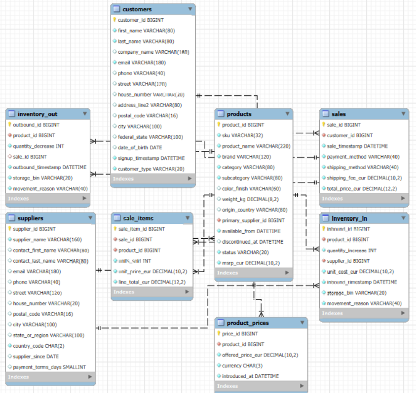

<!-- README.md is generated from README.Rmd. Please edit that file -->

```{r, include = FALSE}
knitr::opts_chunk$set(
  collapse = TRUE,
  comment = "#>"
)


```

# musical_retail_germany

## General information

The SQL database `musical_retail_germany` is a synthetically created database using ChatGPT. It contains sales (and related) information from a fictional online music equipment retailer for the years 2022, 2023, 2024, and 2025. The data is supposed to be messy, thus enforcing some initial data cleaning.

## Structure

The structure of the database is shown in the following figure.

```{r, echo = FALSE, out.width = "80%", out.height = "80%", fig.align='center'}

```

